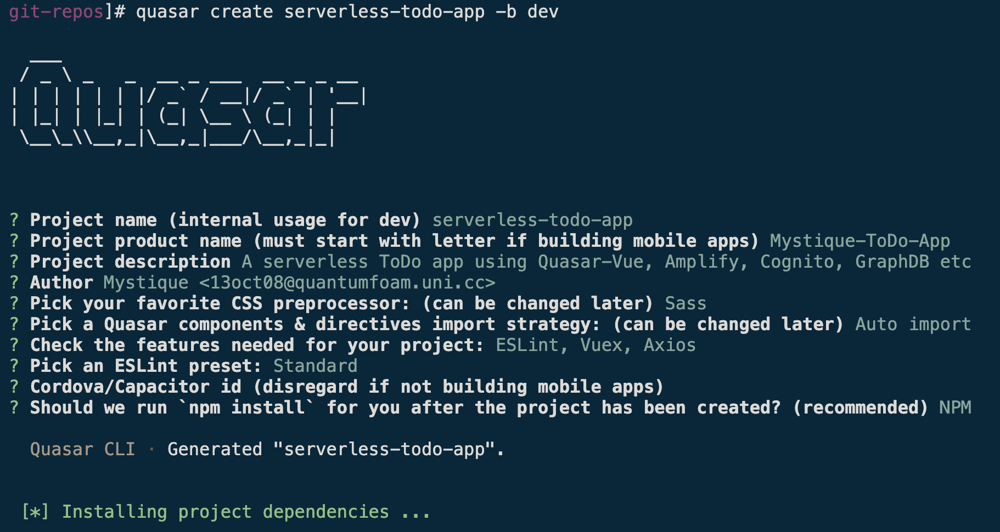
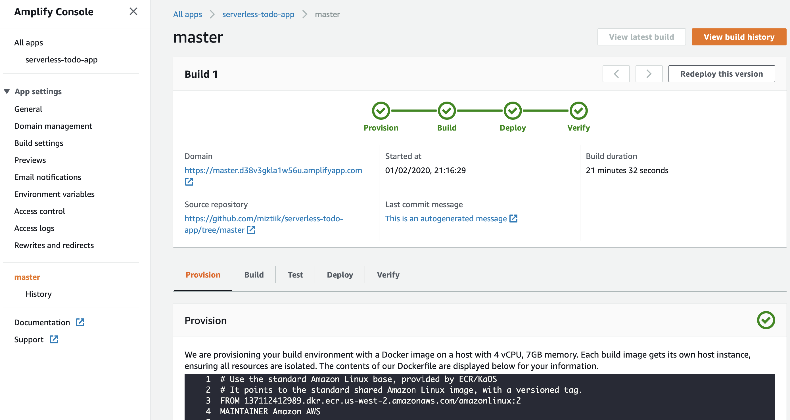

# Serverless ToDo Application

  Let us try to create and deploy a Quasar application using the AWS amplify CLI. For authentication we will use AWS Cognito, and GraphQL API layer from AWS AppSync for the DynamoDB back-end, cloud hosting through AWS CloudFront and AWS S3.

  While you may have already seen many of the concepts and instructions in this tutorial, this document attempts to combine them all into one place and give the reader a clear and concise path forward to Quasar Framework with AWS Amplify and a reference implementation.

  Quasar Framework is a pragmatic, Material Design, full front-end framework built on top of the immensely popular VueJS Javascript library. Quasar allows you to maintain one codebase and easily create web, desktop, mobile, and native mobile applications using Electron and Cordova.

  Credits to [Michael Freeman](https://medium.com/@mfreeman451): This repo is a replica of this [article](https://medium.com/quasar-framework/creating-a-quasar-framework-application-with-aws-amplify-services-part-1-4-9a795f38e16d)

## Prerequisites

- Ensure npm is installed
- AWS CLI pre-configured - [Get help here](https://youtu.be/TPyyfmQte0U)

## Environment Setup

1. ### Install `vue` cli

    ```bash
    npm install -g @vue/cli
    ```

1. ### Install `quasar`

    ```bash
    npm install -g @quasar/cli
    ```

1. ### Create the Vue/Quasar application

    We are going to create an app called `serverless-todo-app` in the `dev` branch

    ```bash
    quasar create serverless-todo-app -b dev
    ```

    

1. ### Install plugins

    Let’s go ahead and install some of the other AWS `npm` modules we need.

    **NOTE:**If there any dependancies required, go ahead and install them using npm.

    ```bash
    cd serverless-todo-app
    npm install --save aws-amplify
    npm install --save aws-amplify-vue
    npm install --save aws-appsync
    npm install --save graphql
    npm install --save graphql-tag
    npm install --save vue-apollo
    npm install --save eslint-plugin-vue
    ```

1. ### Install `amplify`

    ```bash
    npm install -g @aws-amplify/cli
    ```

1. ### 🔧 Configure `amplify`

    Configure your amplify by running `amplify configure` [Get help here](https://www.youtube.com/watch?v=n4DuYTzpvdE)

1. ### Create Amplify Project

    Before initializing the project ensure `amplify` is configured,

    ```bash
    amplify init
    ```

    Here are some of the choices, that were made,
    

    ```bash
    serverless-todo-app]# amplify init
    Note: It is recommended to run this command from the root of your app directory
    ? Enter a name for the project serverless-todo-app
    ? Enter a name for the environment dev
    ? Choose your default editor: Visual Studio Code
    ? Choose the type of app that you are building javascript
    Please tell us about your project
    ? What javascript framework are you using none
    ? Source Directory Path:  src
    ? Distribution Directory Path: dist/pwa
    ? Build Command:  quasar build -m pwa
    ? Start Command: quasar serve --history dist/pwa
    Using default provider  awscloudformation

    For more information on AWS Profiles, see:
    https://docs.aws.amazon.com/cli/latest/userguide/cli-multiple-profiles.html

    ? Do you want to use an AWS profile? Yes
    ? Please choose the profile you want to use default
    ```

1. ### Add Auth: AWS Cognito

    We will use AWS Cognito for authentication,

    ```bash
    amplify add auth
    ```

    

    _Output_,

    ```bash
    serverless-todo-app]# amplify add auth
    Using service: Cognito, provided by: awscloudformation

    The current configured provider is Amazon Cognito.

    Do you want to use the default authentication and security configuration? Default configuration
    Warning: you will not be able to edit these selections.
    How do you want users to be able to sign in? Email
    Do you want to configure advanced settings? No, I am done.
    ```

1. #### Check status of amplify project - 01

    ```bash
    amplify status
    ```

    The output should be something like,

    ```bash
    serverless-todo-app]# amplify status

    Current Environment: dev

    | Category | Resource name             | Operation | Provider plugin   |
    | -------- | ------------------------- | --------- | ----------------- |
    | Auth     | serverlesstodoapp664af3d8 | Create    | awscloudformation |
    ```

1. ### Add API: AWS AppSync

    ```bash
    amplify add api
    ```

    ```bash
    serverless-todo-app]# amplify add api
    ? Please select from one of the below mentioned services: GraphQL
    ? Provide API name: todoApi
    ? Choose the default authorization type for the API Amazon Cognito User Pool
    Use a Cognito user pool configured as a part of this project.
    ? Do you want to configure advanced settings for the GraphQL API No, I am done.
    ? Do you have an annotated GraphQL schema? No
    ? Do you want a guided schema creation? Yes
    ? What best describes your project: Single object with fields (e.g., “Todo” with ID, name, description)
    ? Do you want to edit the schema now? Yes
    ```

    Edit the default GraphQL schema (_schema shown below_),
    - `@model` transformer tells Amplify to create a table in DynamoDB modeled after our GraphQL schema,
    - `@searchable` does the same in AWS ElasticSearch.
    - `@auth` transformer says only the owner can query

    And we are adding two new fields, `owner` and `dateTime`.

    ```bash
    type Todo @model @searchable @auth(rules: [{ allow: owner }]) {
    id: ID!
    name: String!
    owner: String
    date: AWSDate
    description: String
    completed: Boolean!
    }
    ```

    The output,

    ```bash
    Please edit the file in your editor: /serverless-todo-app/amplify/backend/api/todoApischema.graphql
    ? Press enter to continue
    GraphQL schema compiled successfully.
    ```

1. #### Check status of amplify project - 02

    ```bash
    amplify status
    ```

    The output should be something like,

    ```bash
    serverless-todo-app]# amplify status

    Current Environment: dev

    | Category | Resource name             | Operation | Provider plugin   |
    | -------- | ------------------------- | --------- | ----------------- |
    | Auth     | serverlesstodoapp664af3d8 | Create    | awscloudformation |
    | Api      | todoApi                   | Create    | awscloudformation |
    ```

## Deploy Quasar App Scaffolding

1. ### Deploy App: Continuous Deployment with AWS Ampify

    If you haven’t created a new repository and added your project to it yet, now would be a good time to do so. We will connect this `repo` to `AWS Amplify`.

    I have already created this repo `https://github.com/miztiik/serverless-todo-app.git`

    ```bash
    git init
    git add .
    git commit -m "Mystique Initial commit"
    git remote add origin git@github.com:miztiik/serverless-todo-app.git
    git push origin master
    ```

    We will also configure `amplify build` steps to use `quasar` commands and publish as `pwa`

1. ### Login to AWS Console

    - Navigate to [AWS Amplify Console](https://console.aws.amazon.com/amplify/home)
    - Authorize `Amplify` to access your `github` account & select the repo and branch
        
    - Choose `dev` for environment (_Unless you used a different name for env name, during `amplify init`_)
    - Choose ‘amplifyconsole-backend-role’ for role
    - Update the `build` settings to reflect these, or copy the `amplify.yaml`(file can be found in git repo) to the root directory of your app

        ```yaml
        version: 0.1
        backend:
        phases:
            # IMPORTANT - Please verify your build commands
            build:
            commands:
                - '# Execute Amplify CLI with the helper script'
                - amplifyPush --simple
        frontend:
        phases:
            preBuild:
            commands:
                - npm install -g @quasar/cli
                - npm ci
            build:
            commands:
                - quasar build -m pwa
        artifacts:
            # IMPORTANT - Please verify your build output directory
            baseDirectory: /dist/pwa
            files:
            - '**/*'
        cache:
            paths:
            - node_modules/**/*

        ```

    - Save changes > **Next** > **Save and Deploy**
        
    - Check the _Domain Url_ in your browser

## Add FrontEnd to App

1. ### Install `quasar` plugin for `amplify` & `AppSync`

    ```bash
    quasar new boot amplify
    quasar new boot appsync
    ```

1. ### Configure `quasar amplify` plugin

    Replace the code in `src/boot/amplify.js` with the following, This gives us `this.$Amplify` and `this.$AmplifyEventBus` on the global Vue instance, accessible by our components. There is also a route guard that protects all routes except `/auth` .

    ```javascript
    import Amplify, * as AmplifyModules from 'aws-amplify'
    import {
    AmplifyPlugin,
    AmplifyEventBus
    } from 'aws-amplify-vue'
    import AwsExports from '../aws-exports'
    Amplify.configure(AwsExports)

    export default async ({
    router,
    Vue
    }) => {
    Vue.use(AmplifyPlugin, AmplifyModules)
    Vue.prototype.$Amplify = Amplify
    Vue.prototype.$AmplifyEventBus = AmplifyEventBus
    Vue.prototype.$Auth = AmplifyModules.Auth

    router.beforeResolve((to, from, next) => {
        if (to.matched.some(record => record.meta.requiresAuth)) {
        // eslint-disable-next-line no-unused-vars
        let user
        Vue.prototype.$Amplify.Auth.currentAuthenticatedUser().then(data => {
            if (data && data.signInUserSession) {
            user = data
            }
            next()
        }).catch((e) => {
            next({
            path: '/auth'
            })
        })
        }
        next()
    })
    }

    ```

1. ### Update `quasar.conf.js`

    - Add/modify the `boot`: object to include the following: _single quote ' is to be used_
    

      ```javascript
      'axios', 'amplify', 'appsync'
      ```

    - Our `ToDo` app needs some more Quasar components. Let us add them to `quasar.conf.js`
    

      ```javascript
      'QInput',
      'QDate',
      'QTime',
      'QPopupProxy',
      'QCircularProgress'
      ```

1. ### Update `appsync` config

    - Add the following code to the `src/boot/appsync.js` file

        ```javascript
        // import something here
        import Vue from 'vue'
        import VueApollo from 'vue-apollo'
        import AWSAppSyncClient from 'aws-appsync'
        import awsmobile from '../aws-exports'

        const config = {
        url: awsmobile.aws_appsync_graphqlEndpoint,
        region: awsmobile.aws_appsync_region,
        auth: {
            type: awsmobile.aws_appsync_authenticationType,
            jwtToken: async () => (await Vue.prototype.$Auth.currentSession()).getIdToken().getJwtToken()
        }
        }

        // The default fetchPolicy is cache-first. This means that if data
        // is returned from the cache, no network request will be sent. If
        // a new item is in a list, this will not be realised. So here we change
        // the policy so that network requests are always sent after data is returned
        // from the cache.
        const options = {
        defaultOptions: {
            watchQuery: {
            fetchPolicy: 'cache-and-network'
            },
            connectToDevTools: true, // Remove this for production use
            disableOffline: true
        }
        }

        const client = new AWSAppSyncClient(config, options)
        const appsyncProvider = new VueApollo({
        defaultClient: client
        })

        // leave the export, even if you don't use it
        export default async ({
        app,
        router,
        Vue
        }) => {
        // something to do
        Vue.use(VueApollo)
        app.apolloProvider = appsyncProvider
        }

        ```

1. ### Add `quasar pages`

    Now add pages for `Authentication`, `Profile`, and `CRUD` pages that will be behind protected routes (only logged in users can access)

    ```bash
    quasar new p Auth
    quasar new p Todo
    quasar new p Profile
    quasar new p SignUp
    quasar new p SignIn
    ```

    _You can also copy the pages from the github repo to your repository_

    - Let’s add our Auth code, Copy the code below to the `src/pages/Auth.vue` file(replace the existing text):

        ```vue
        <template>
        <div class="auth">
            <sign-up :toggle="toggle" v-if="formState === 'signUp'"></sign-up>
            <sign-in v-if="formState === 'signIn'"></sign-in>
            <div class="row justify-end">
            <q-btn @click="toggle" type="submit" class="authButton">
                {{ formState === 'signUp' ?
                'Already signed up? Sign In' : 'Need an account? Sign Up'
                }}
            </q-btn>
            </div>
        </div>
        </template>
        <script>
        import SignUp from './SignUp'
        import SignIn from './SignIn'
        export default {
        name: 'app',
        components: {
            SignUp,
            SignIn
        },
        data () {
            return {
            formState: 'signUp'
            }
        },
        methods: {
            toggle () {
            this.formState === 'signUp' ? this.formState = 'signIn' : this.formState = 'signUp'
            }
        }
        }
        </script>
        <style scoped>
        .auth {
        margin: 0 auto;
        width: 460px;
        }
        .toggle {
        cursor: pointer;
        font-size: 18px;
        }
        * {
        box-sizing: border-box;
        }
        .authButton {
        width: 100%;
        padding: 10px;
        margin-top: 10px;
        background-color: #2196f3;
        border: none;
        color: white;
        outline: none;
        }
        .button {
        cursor: pointer;
        }
        .button:hover {
        opacity: 0.5;
        }
        .text {
        margin-top: 4px;
        margin-bottom: 0px;
        }
        .delete {
        color: #2196f3;
        }
        .todo {
        display: block;
        border-bottom: 1px solid rgba(0, 0, 0, 0.2);
        text-align: center;
        padding-top: 8px;
        padding-bottom: 9px;
        }
        ul {
        list-style-type: none;
        padding: 0;
        }
        li {
        display: inline-block;
        margin: 0 10px;
        }
        </style>

        ```

    - Let’s add our Auth code, Copy the code below to the `src/pages/SignIn.vue` file(replace the existing text):

        ```vue
        <template>
        <div class="auth">
            <h2>Sign In</h2>
            <form @submit.prevent="signIn">
            <q-input square filled color="teal" label="Username" v-model="form.username"/>
            <q-input square filled color="teal" label="Password" type="password" v-model="form.password"/>
            <div class="row">
                <q-btn type="submit" @click="signIn" label="Sign In" class="authButton">
                <template v-slot:loading>
                    <q-spinner-facebook/>
                </template>
                </q-btn>
            </div>
            </form>
        </div>
        </template>
        <script>
        export default {
        name: 'SignIn',
        data () {
            return {
            form: {
                username: '',
                password: ''
            }
            }
        },
        methods: {
            async signIn () {
            const { username, password } = this.form
            await this.$Auth.signIn(username, password)
            this.$AmplifyEventBus.$emit('authState', 'signedIn')
            parent.signedIn = true
            this.$router.push({ name: 'todo' })
            }
        }
        }
        </script>
        <style>
        .authButton {
        width: 100%;
        padding: 10px;
        margin-top: 10px;
        background-color: #2196f3;
        border: none;
        color: white;
        outline: none;
        }
        .auth {
        margin: 0 auto;
        width: 460px;
        }
        </style>

        ```

    - Let’s add our Auth code, Copy the code below to the `src/pages/SignUp.vue` file(replace the existing text):

        ```vue
        <template>
        <div class="auth">
            <h2>{{ formState === 'signUp' ? 'Sign Up' : 'Confirm Sign Up' }}</h2>
            <form @submit.prevent="signUp">
            <div v-if="formState === 'signUp'">
                <q-input square filled color="teal" label="Username" v-model="form.username"/>
                <q-input
                square
                filled
                color="teal"
                label="Password"
                type="password"
                v-model="form.password"
                />
                <q-input square filled color="teal" label="E-mail" v-model="form.email"/>
                <div class="row">
                <q-btn type="submit" @click="signUp" label="Sign Up" class="authButton">
                    <template v-slot:loading>
                    <q-spinner-facebook/>
                    </template>
                </q-btn>
                </div>
            </div>
            <div v-if="formState === 'confirmSignUp'">
                <q-input square filled color="teal" v-model="form.authCode"/>
                <div class="row">
                <q-btn type="submit" @click="confirmSignUp" label="Verification code" class="authButton">
                    <template v-slot:loading>
                    <q-spinner-facebook/>
                    </template>
                </q-btn>
                </div>
            </div>
            </form>
        </div>
        </template>
        <script>
        export default {
        name: 'home',
        props: ['toggle'],
        data () {
            return {
            formState: 'signUp',
            form: {
                username: '',
                password: '',
                email: ''
            }
            }
        },
        methods: {
            async signUp () {
            const { username, password, email } = this.form
            await this.$Auth.signUp({
                username, password, attributes: { email }
            })
            this.formState = 'confirmSignUp'
            },
            async confirmSignUp () {
            const { username, authCode } = this.form
            await this.$Auth.confirmSignUp(username, authCode)
            this.toggle()
            }
        }
        }
        </script>
        <style>
        .authButton {
        width: 100%;
        padding: 10px;
        margin-top: 10px;
        background-color: #2196f3;
        border: none;
        color: white;
        outline: none;
        }
        .auth {
        margin: 0 auto;
        width: 460px;
        }
        </style>

        ```

    - Let’s add our Auth code, Copy the code below to the `src/pages/Profile.vue` file(replace the existing text):

        ```vue
        <template>
        <div>
            <h1>Welcome, {{user.username}}</h1>
        </div>
        </template>
        <script>
        export default {
        name: 'Profile',
        components: {
        },
        data () {
            return {
            user: '',
            signedIn: false
            }
        },
        beforeCreate () {
            this.$Auth.currentAuthenticatedUser()
            .then(user => {
                this.user = user
                this.signedIn = true
            })
            .catch(() => console.log('not signed in...'))
        }
        }
        </script>
        <style>
        </style>

        ```

    - Let’s add our Auth code, Copy the code below to the `src/layouts/MyLayout.vue` file(replace the existing text):

        ```vue
        <template>
        <q-layout view="lHh Lpr lFf">
            <q-header elevated class="glossy">
            <q-toolbar>
                <q-btn flat dense round @click="leftDrawerOpen = !leftDrawerOpen" aria-label="Menu">
                <q-icon name="menu"/>
                </q-btn>
                <div class="row">
                <router-link :to="{ name: 'todo' }" tag="span" style="cursor: pointer">
                    <q-toolbar-title>quasar-amplify-demo</q-toolbar-title>
                </router-link>

                <div class="fixed-right">Quasar v{{ $q.version }}</div>
                </div>
            </q-toolbar>
            </q-header>

            <q-drawer v-model="leftDrawerOpen" bordered content-class="bg-grey-2">
            <q-list>
                <q-item-label header>quasar-amplify-demo app</q-item-label>

                <q-item clickable :to="{name: 'todo'}">
                <q-item-section avatar>
                    <q-icon name="note"/>
                </q-item-section>
                <q-item-section>
                    <q-item-label>Todo App</q-item-label>
                    <q-item-label caption>create a todo list..</q-item-label>
                </q-item-section>
                </q-item>

                <div v-if="isLoggedIn">
                <q-item clickable :to="{name: 'profile'}">
                    <q-item-section avatar>
                    <q-icon name="settings"/>
                    </q-item-section>
                    <q-item-section>
                    <q-item-label>Profile</q-item-label>
                    <q-item-label caption>view your profile</q-item-label>
                    </q-item-section>
                </q-item>
                </div>

                <div v-if="isLoggedIn">
                <q-item clickable @click="signOut">
                    <q-item-section avatar>
                    <q-icon name="stop"/>
                    </q-item-section>
                    <q-item-section>
                    <q-item-label>Logout</q-item-label>
                    </q-item-section>
                </q-item>
                </div>

                <div v-if="!isLoggedIn">
                <q-item clickable :to="{name: 'auth'}">
                    <q-item-section avatar>
                    <q-icon name="group"/>
                    </q-item-section>
                    <q-item-section>
                    <q-item-label>Login/SignUp</q-item-label>
                    <q-item-label caption>Login or Signup</q-item-label>
                    </q-item-section>
                </q-item>
                </div>
            </q-list>
            </q-drawer>

            <q-page-container>
            <router-view/>
            </q-page-container>
        </q-layout>
        </template>

        <script>
        import { openURL } from 'quasar'
        export default {
        name: 'MyLayout',
        data () {
            return {
            user: '',
            signedIn: 'false',
            leftDrawerOpen: this.$q.platform.is.desktop
            }
        },
        computed: {
            isLoggedIn () {
            return this.signedIn
            }
        },
        mounted () {
            this.$AmplifyEventBus.$on('authState', info => {
            this.signedIn = true
            })
        },
        beforeCreate () {
            this.$Auth.currentAuthenticatedUser()
            .then(user => {
                this.user = user
                this.signedIn = true
            })
            .catch(() => {
                this.signedIn = false
            })
        },
        methods: {
            openURL,
            async signOut () {
            await this.$Auth.signOut()
                .then(data => console.log(data))
                .catch(err => console.log(err))
            this.signedIn = false
            parent.signedIn = false
            this.$router.push({ name: 'auth' })
            }
        }
        }
        </script>

        <style>
        </style>

        ```

    - Update `App.vue`
        We need to update `App.vue` to add our Amplify authentication router guard and we tell Vue not to render our components until the client has been _rehydrated_

        ```vue
        <template>
        <div id="q-app" v-if="hydrated">
            <router-view/>
        </div>
        </template>

        <script>
        export default {
        name: 'App',
        data () {
            return {
            signedIn: false,
            hydrated: false
            }
        },
        async mounted () {
            await this.$apollo.provider.defaultClient.hydrated()
            this.hydrated = true
        },
        beforeCreate () {
            this.$AmplifyEventBus.$on('authState', info => {
            if (info === 'signedIn') {
                this.signedIn = true
                this.$router.push('/')
            }
            if (info === 'signedOut') {
                this.$router.push('/auth')
                this.signedIn = false
            }
            })
            this.$Auth.currentAuthenticatedUser()
            .then(user => {
                this.signedIn = true
            })
            // eslint-disable-next-line
            .catch(() => this.signedIn = false)
        }
        }
        </script>

        <style>
        </style>

        ```

    - Add Global CSS stylings `src/css/app.styl`
        We will place our global CSS definitions in `src/css/app.styl`:

        ```css
        #q-app {
        font-family: "Avenir", Helvetica, Arial, sans-serif;
        -webkit-font-smoothing: antialiased;
        -moz-osx-font-smoothing: grayscale;
        color: #2c3e50;
        padding-top: 20px;
        padding-bottom: 20px;
        }
        ```

    - Finally,Update `src/pages/Todo.vue`

        We will complete our example ToDo application by adding the following code to `src/pages/Todo.vue`:

        ```vue
        <template>
        <div class="todo">
            <div v-if="$apollo.loading">
            <div class="text-xs-center">
                <q-circular-progress indeterminate size="50px" color="lime" class="q-ma-md"/>
            </div>
            </div>
            <form @submit.prevent.stop="onCreate" class="q-pa-md">
            <div class="q-pa-md" style="max-width: 420px">
                <q-input
                type="text"
                ref="name"
                filled
                color="teal"
                dense
                label="Name"
                clearable
                lazy-rules
                :rules="[ val => val && val.length > 0 || 'Missing name']"
                v-model="name"
                />
                <q-input
                type="text"
                ref="description"
                filled
                color="teal"
                dense
                label="Description"
                clearable
                lazy-rules
                :rules="[ val => val && val.length > 0 || 'Missing description']"
                v-model="description"
                />

                <q-input
                type="date"
                ref="date"
                filled
                dense
                lazy-rules
                :rules="[ val => val && val.length > 0 || 'Missing date']"
                v-model="date"
                >
                <template v-slot:append>
                    <q-icon name="event"></q-icon>
                </template>
                </q-input>

                <div class="row center">
                <q-btn type="submit" label="Create Todo" class="todoButton">
                    <template v-slot:loading>
                    <q-spinner-facebook/>
                    </template>
                </q-btn>
                </div>

                <ul>
                <li class="todo" v-for="(todo, index) in todos" :key="index">
                    <p class="todoname">{{ todo.name }}</p>
                    <p class="text">{{ todo.description }}</p>
                    <p class="text">Due: {{ todo.date }}</p>
                    <p
                    @click="toggleComplete(todo)"
                    class="text button"
                    >{{ todo.completed ? 'completed' : 'not completed' }}</p>
                    <p @click="deleteTodo(todo)" class="text button delete">Delete todo item</p>
                </li>
                </ul>
            </div>
            </form>
        </div>
        </template>

        <script>
        import gql from 'graphql-tag'
        import { listTodos } from '../graphql/queries'
        import { createTodo, deleteTodo, updateTodo } from '../graphql/mutations'
        import uuidV4 from 'uuid/v4'
        import { date } from 'quasar'
        export default {
        name: 'Todo',
        computed: {
            date () {
            let timeStamp = Date.now()
            let formattedString = date.formatDate(timeStamp, 'YYYY-MM-DD')
            return formattedString
            }
        },
        data () {
            return {
            name: '',
            description: '',
            owner: 'foo', // this is just a placeholder and will get updated by AppSync resolver
            user: '',
            todos: []
            }
        },
        beforeCreate () {
            this.$Auth.currentAuthenticatedUser()
            .then(user => {
                this.user = user
                this.signedIn = true
            })
            .catch(() => this.$router.push({ name: 'auth' }))
        },
        methods: {
            onCreate () {
            this.$refs.name.validate()
            this.$refs.description.validate()
            this.$refs.date.validate()
            if (this.$refs.name.hasError || this.$refs.description.hasError || this.$refs.date.hasError) {
                this.formHasError = true
                this.$q.notify({
                color: 'negative',
                message: 'Missing form fields'
                })
            } else {
                this.$q.notify({
                icon: 'done',
                color: 'positive',
                message: 'Submitted'
                })
                this.createTodo()
            }
            },
            toggleComplete (todo) {
            const updatedTodo = {
                ...todo,
                completed: !todo.completed
            }
            // graphql layers dont like __typename in our object
            delete updatedTodo.__typename
            this.$apollo.mutate({
                mutation: gql(updateTodo),
                variables: { input: updatedTodo },
                update: (store, { data: { updateTodo } }) => {
                const data = store.readQuery({ query: gql(listTodos) })
                const index = data.listTodos.items.findIndex(item => item.id === updateTodo.id)
                data.listTodos.items[index] = updateTodo
                store.writeQuery({ query: gql(listTodos), data })
                },
                optimisticResponse: {
                __typename: 'Mutation',
                updateTodo: {
                    __typename: 'Todo',
                    ...updatedTodo
                }
                }
            })
                .then(data => console.log(data))
                .catch(error => console.error(error))
            },
            deleteTodo (todo) {
            this.$apollo.mutate({
                mutation: gql(deleteTodo),
                variables: {
                input: { id: todo.id }
                },
                update: (store, { data: { deleteTodo } }) => {
                const data = store.readQuery({ query: gql(listTodos) })
                data.listTodos.items = data.listTodos.items.filter(todo => todo.id !== deleteTodo.id)
                store.writeQuery({ query: gql(listTodos), data })
                },
                optimisticResponse: {
                __typename: 'Mutation',
                deleteTodo: {
                    __typename: 'Todo',
                    ...todo
                }
                }
            })
                .then(data => console.log(data))
                .catch(error => console.error(error))
            },
            createTodo () {
            const name = this.name
            const date = this.date
            const description = this.description
            const owner = this.user.username
            const id = uuidV4()
            const todo = {
                name: name,
                id,
                date,
                owner,
                description,
                completed: false
            }
            this.$apollo.mutate({
                mutation: gql(createTodo),
                variables: { input: todo },
                update: (store, { data: { createTodo } }) => {
                const data = store.readQuery({ query: gql(listTodos) })
                data.listTodos.items.push(createTodo)
                store.writeQuery({ query: gql(listTodos), data })
                },
                optimisticResponse: {
                __typename: 'Mutation',
                createTodo: {
                    __typename: 'Todo',
                    ...todo
                }
                }
            })
                .then(data => console.log(data))
                .catch(error => console.error('error!!!: ', error))
            }
        },
        apollo: {
            todos: {
            query: gql(listTodos),
            update: data => data.listTodos.items
            }
        }
        }
        </script>

        <!-- Add "scoped" attribute to limit CSS to this component only -->
        <style scoped>
        * {
        box-sizing: border-box;
        }
        .todoButton {
        width: 100%;
        padding: 10px;
        margin-top: 10px;
        background-color: #2196f3;
        border: none;
        color: white;
        outline: none;
        }
        .button {
        cursor: pointer;
        }
        .button:hover {
        opacity: 0.5;
        }
        .todoname {
        margin-top: 4px;
        margin-bottom: 0px;
        font-weight: bold;
        }
        .text {
        margin-top: 4px;
        margin-bottom: 0px;
        }
        .delete {
        color: #2196f3;
        }
        .todo {
        display: block;
        border-bottom: 1px solid rgba(0, 0, 0, 0.2);
        text-align: center;
        padding-top: 8px;
        padding-bottom: 9px;
        }
        ul {
        list-style-type: none;
        padding: 0;
        }
        li {
        display: inline-block;
        margin: 0 10px;
        }
        </style>

        ```

1. ### Configure `quasar routes`
1. ### <summary>Configure `quasar routes`</summary>

    We will create routes for the following,
    - Auth
    - Todo
    - Profile
    - Error404

    Modify `src/router/routes.js`

    ```javascript
    const routes = [{
    path: '/',
    component: () => import('layouts/MyLayout.vue'),
    children: [{
        path: '',
        name: 'todo',
        component: () => import('pages/Todo.vue'),
        meta: {
        requiresAuth: true
        }
    }]
    },
    {
    path: '/auth',
    component: () => import('layouts/MyLayout.vue'),
    children: [{
        path: '',
        name: 'auth',
        component: () => import('pages/Auth.vue'),
        meta: {
        requiresAuth: false
        }
    }]
    },
    {
    path: '/profile',
    component: () => import('layouts/MyLayout.vue'),
    children: [{
        name: 'profile',
        path: '',
        component: () => import('pages/Profile.vue'),
        meta: {
        requiresAuth: true
        }
    }]
    }
    ]
    // Always leave this as last one
    if (process.env.MODE !== 'ssr') {
    routes.push({
        path: '*',
        component: () => import('pages/Error404.vue')
    })
    }
    export default routes

    ```

## 🎯Pushing to Production🎁🎉🏁

Every time you make commit to your git repository, the Continuous Deployment we setup within the AWS Amplify console will build and deploy your site.

Wait for the build to complete and navigate to your app url,


### 🔍Gotchas

1. `aws-exports.js` indentation error

    ⚙️ Try this: `./node_modules/.bin/eslint --fix src`

1. `graphql` compilation error

    ⚙️ Try this: [Github - Compile error with webpack 4 #1272](https://github.com/graphql/graphql-js/issues/1272)

#### 📖 References

1. [Project Source](https://medium.com/quasar-framework/creating-a-quasar-framework-application-with-aws-amplify-services-part-1-4-9a795f38e16d)

1. [AWS Amplify Gihub](https://aws-amplify.github.io/docs/)
1. [AWS GraphQL Schema: Scalars](https://docs.aws.amazon.com/appsync/latest/devguide/scalars.html)
